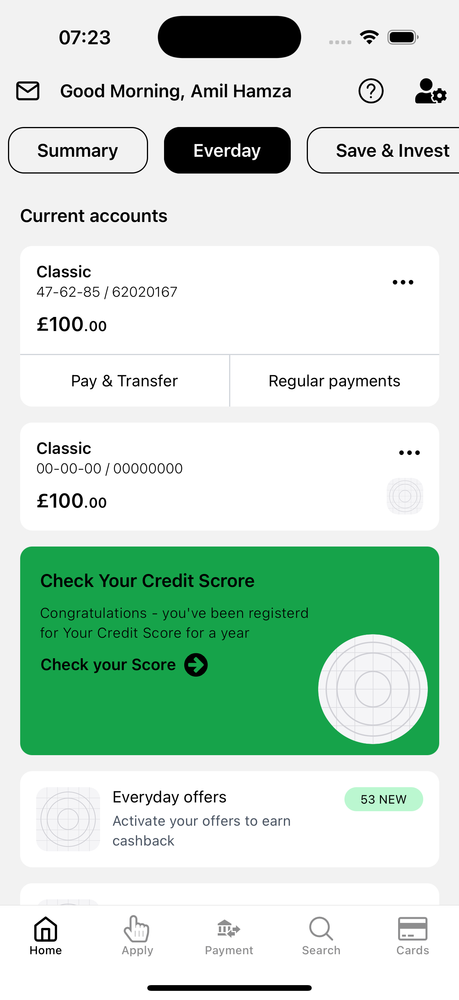
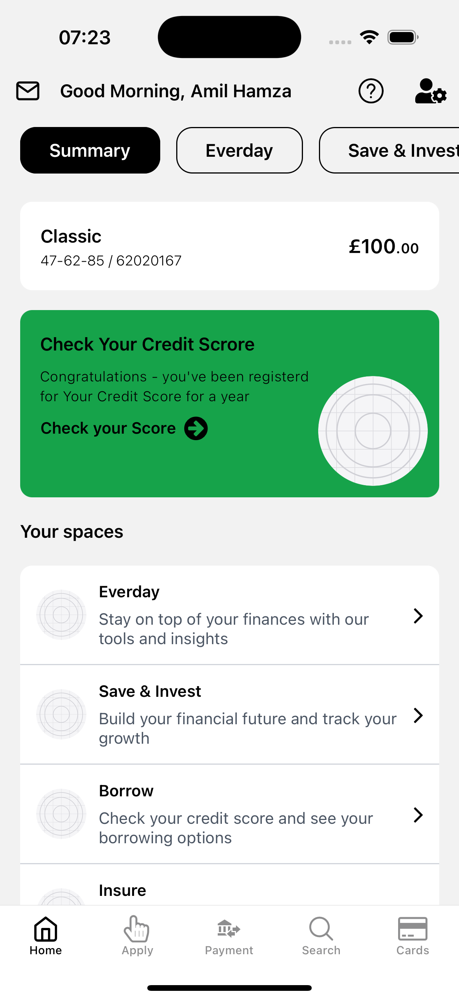
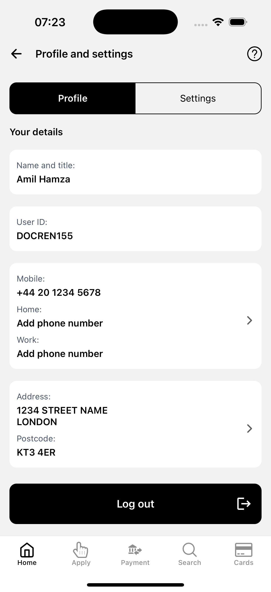
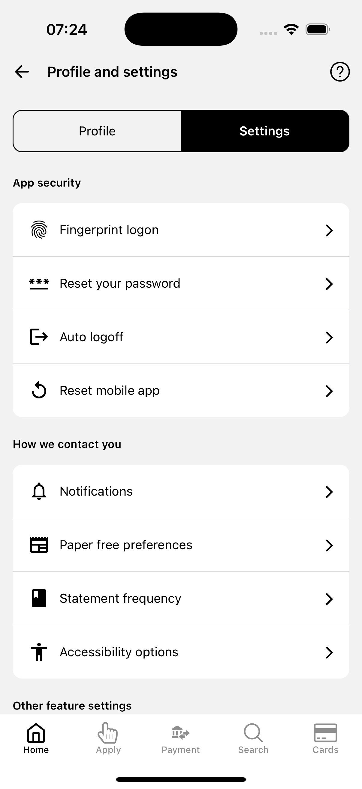
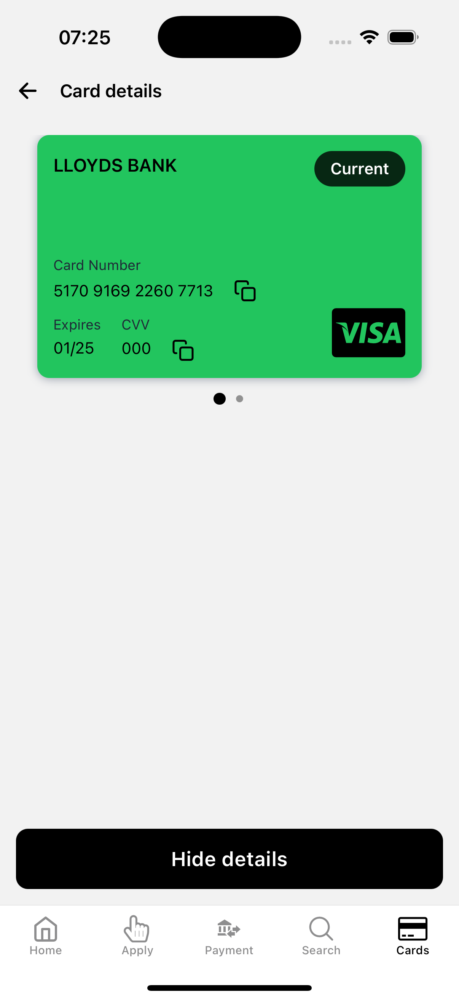
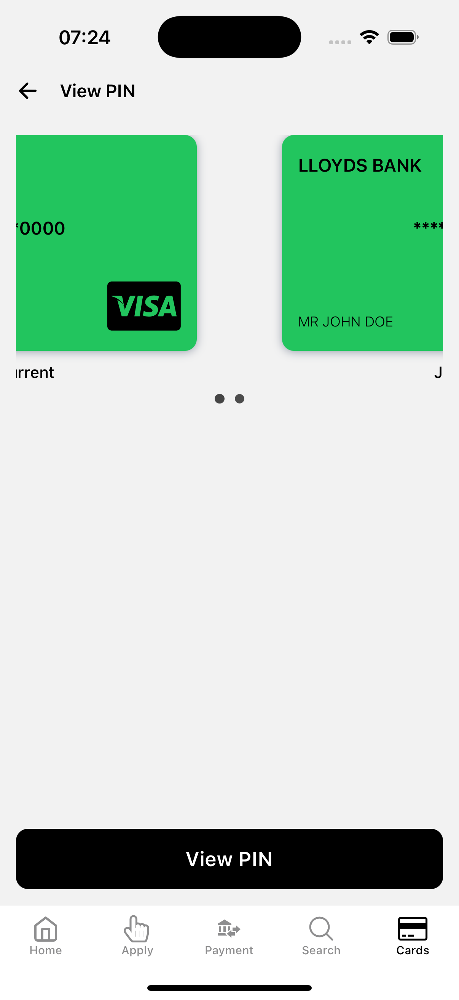
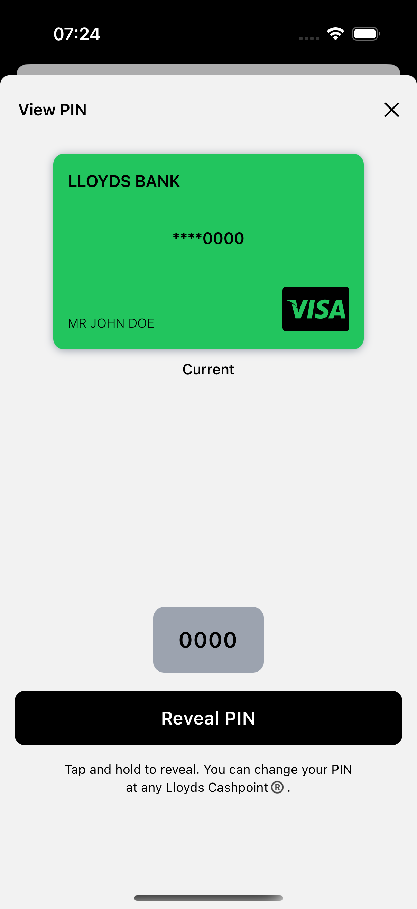
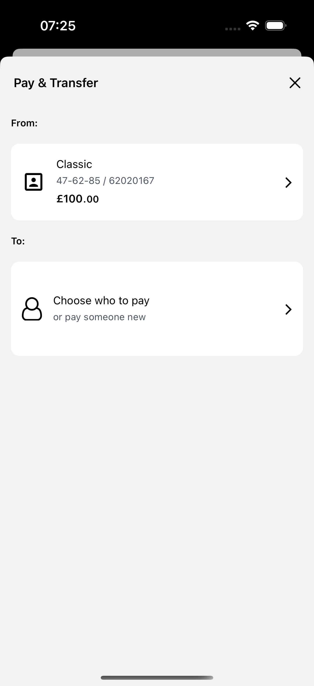
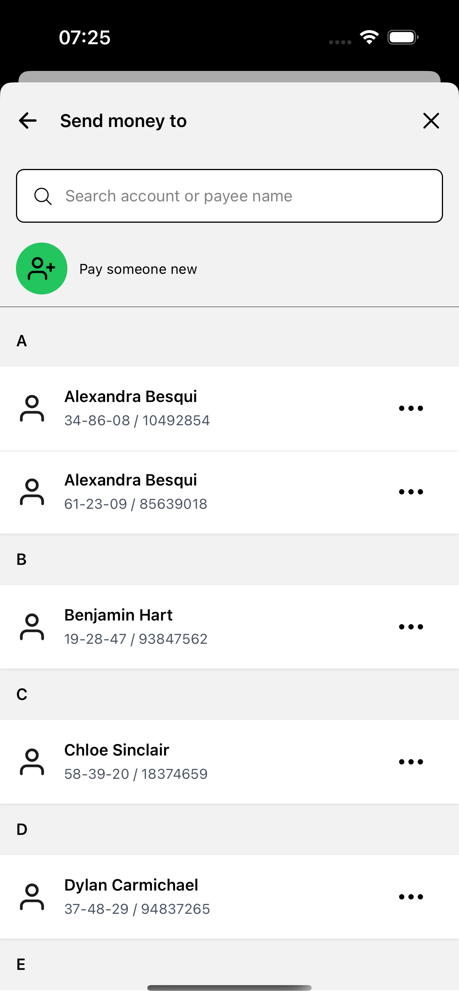

# Lloyds Clone

This project is a clone of the Lloyds banking application, built using React Native and TypeScript. It includes various features such as authentication, creating a new payee, viewing account details, and making payments.

## Screenshots

|                                                                  |                                                               |                                                                           |
| :--------------------------------------------------------------: | :-----------------------------------------------------------: | :-----------------------------------------------------------------------: |
|  Home(Everyday) |  Home(Summary) |  Settings(Profile) |
|          Settings         |  Card details  |              View pin              |
|    Revealed pin   |          Payment         |     Selecting payee     |

More in the screenshot folder. [Screenshot](./screenshots/)

## Features

- Authentiication
- Create a new payee
- View account details
- Make payments
- Card management

## Technologies Used

- Expo
- Expo Router
- React Native
- TypeScript
- Nativewind
- React Hook Form
- Zod
- Tanstack Query
- Axios
- TabView

## Getting started

### Prerequisites

- Node.js
- pnpm
- Expo CLI

#### API Express Project

Check out this repo to run the express server. ([Express API](https://github.com/amilmohd155/lloyds-clone-api))

#### Environment Variables

To run this project, you will need to add the following environment variables to your .env file

`EXPO_PUBLIC_API_URL` - http://localhost:1205 / http://IP:1205 where the express app mentioned above is running, if port was changed, make appropriate changes.

### Installation

1. Clone the repository:
   ```sh
   git clone https://github.com/your-username/lloyds-clone.git
   ```
2. Navigate to the project directory:
   ```sh
   cd lloyds-clone
   ```
3. Install dependencies:
   ```sh
   pnpm install
   ```

### Running the App

1. Start the Expo development server:

   ```sh
   pnpm start
   ```

2. Use the Expo app on your mobile device or an emulator to scan the QR code and run the application.

## Project Structure

- `src/`: Contains the source code of the application
  - `api/`: API calls and services
  - `components/`: Reusable UI components
  - `libs/`: Utility functions and libraries
  - `schema/`: Form validation schemas
  - `screens/`: Application screens
  - `app/`: Main application logic and routing

## License

This project is licensed under the MIT License.

[MIT](https://choosealicense.com/licenses/mit/)
